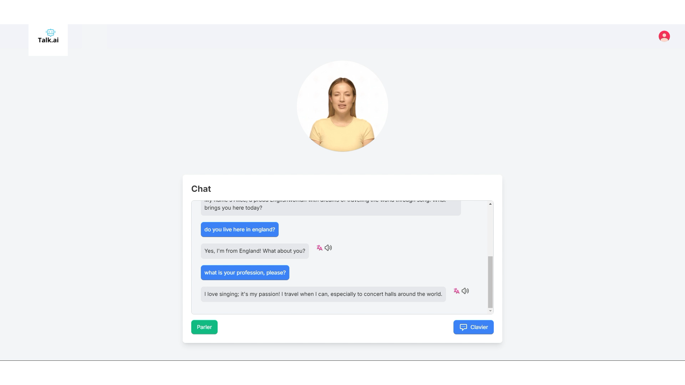

# Projet AI Tutor

Ce projet est une application web pour un service d'IA qui utilise des modèles de traitement du langage naturel (NLP) pour engager des conversations interactives. Le système comprend une API backend, un modèle d'IA pour la génération de texte, et des outils de transcription audio. Le projet est construit avec **FastAPI** et **Docker** pour une mise en œuvre continue via une pipeline CI/CD.

⚠️ **Note Importante** : Un GPU est **obligatoire** pour exécuter cette application de manière optimale. L'application utilise des modèles d'IA gourmands en ressources, tels que **Whisper** et **Phi3** pour la transcription et la génération de texte. Assurez-vous que votre machine dispose d'un GPU compatible pour éviter les ralentissements ou échecs d'exécution.

## Interface de l'application



## Démo Vidéo

Regardez la démo vidéo de l'application en cliquant sur le lien suivant :

[Voir la démo sur YouTube](https://www.youtube.com/watch?v=FQ0OTguo_iA)

## Fonctionnalités IA & principales

- **Chat IA** : L'IA engage des conversations naturelles avec les utilisateurs.
- **Traduction de phrases** : L'IA peut traduire des phrases en anglais vers le français à la demande de l'utilisateur. Il suffit de dire : *"How do you say in English : [votre phrase en français]"*.
- **Évaluation de phrases** : L'IA évalue la qualité des phrases en anglais pour déterminer si elles sont acceptables dans une conversation simple.
- **Détection de langue** : L'IA peut détecter si l'utilisateur parle en français ou en anglais, et demande de parler en anglais si la langue n'est pas reconnue.
- **Transcription audio** : Conversion de l'audio en texte à l'aide de **Whisper**.
- **Génération de réponses** : Utilisation du modèle **Phi3** via l'API Ollama pour générer des réponses personnalisées. Vous pouvez également choisir et paramétrer d'autres modèles d'Ollama.
- **Synthèse vocale (TTS)** : Utilisation de **Coqui TTS** pour générer des fichiers audio à partir de texte.
- **Durée personnalisée des sessions** : Les utilisateurs peuvent choisir la durée de leurs sessions de conversation.
- **Historique des conversations** : Les utilisateurs peuvent consulter l'historique de leurs conversations passées.
- **Compte rendu de session** : À la fin de chaque session, un rapport détaillé est généré, incluant des statistiques et des analyses de performance.
- **Logs des métriques** : Les temps de réponse et autres métriques sont enregistrés dans des fichiers CSV pour analyse.
- **Pipeline CI/CD** : Automatisation des tests et déploiement continu avec Docker et GitHub Actions.
- **Tests automatisés** : Tests unitaires et tests d'intégration pour valider les fonctionnalités principales.

## Fonctionnalités Utilisateur

- **Compte utilisateur** : Chaque utilisateur dispose de son propre compte pour se connecter à l'application, accéder à ses sessions passées et revoir son historique de conversation.
- **Historique des conversations** : L'utilisateur peut visualiser toutes ses sessions de conversation antérieures avec des détails sur chaque interaction.
- **Rapport de session** : À la fin de chaque session, un rapport complet est généré, comprenant des statistiques telles que le nombre de messages échangés, les erreurs de compréhension, et une analyse des performances, notamment le temps de réponse moyen et le nombre de phrases correctes.
- **Durée personnalisée des sessions** : L'utilisateur peut définir la durée de sa session avant de commencer, ce qui permet de personnaliser l'expérience selon ses besoins.

## Technologies utilisées

- **Python 3.11**
- **FastAPI** pour l'API backend
- **Docker** pour la conteneurisation
- **PostgreSQL** pour la base de données
- **NLTK**, **SpaCy** et **Whisper** pour les modèles de traitement du langage naturel
- **Coqui TTS** pour la synthèse vocale
- **Ollama API** pour la génération de texte (par défaut, le modèle **Phi3** est utilisé, mais d'autres modèles peuvent être configurés)
- **GitHub Actions** pour CI/CD
- **Métriques enregistrées en CSV** pour les performances (temps de réponse, qualité de la phrase, etc.)

## Installation

### Prérequis

- **Docker** et **Docker Compose**
- **Python 3.11** et **pip**
- **GPU obligatoire** : Assurez-vous que votre machine dispose d'un GPU compatible (ex. NVIDIA avec des pilotes CUDA) pour exécuter les modèles d'IA efficacement.

### Étapes d'installation

1. Clonez le dépôt :
    ```bash
    git clone https://github.com/votre-repository/ai_tutor.git
    cd ai_tutor
    ```

2. Créez un fichier `.env` en copiant le fichier `.env.example` et modifiez-le avec vos informations de base de données :
    ```bash
    cp .env.example .env
    ```

3. Construisez et démarrez les services Docker :
    ```bash
    docker-compose up --build
    ```

4. Une fois que les conteneurs sont démarrés, vous pouvez accéder à l'application en ouvrant un navigateur et en visitant :
    ```
    http://localhost:8000
    ```

5. Pour arrêter les conteneurs Docker, utilisez la commande :
    ```bash
    docker-compose down
    ```

## Configuration des modèles

- **Whisper** : Le modèle de transcription audio **Whisper** peut être paramétré selon les besoins en termes de précision et de rapidité.
- **Ollama (Phi3 par défaut)** : Vous pouvez choisir différents modèles d'Ollama pour la génération de réponses. Par défaut, le modèle **Phi3** est utilisé, mais il est possible de configurer un autre modèle via les paramètres de l'API.

## Tests et métriques

- **Tests unitaires** : Le projet inclut des tests unitaires pour vérifier les principales fonctionnalités de l'application.
- **Tests d'intégration IA** : Des tests d'intégration sont également disponibles pour valider le bon fonctionnement des composants IA.
- **Logs des métriques** : Les métriques de performance comme les temps de réponse (transcription, génération de texte) sont enregistrées dans un fichier CSV pour analyse.
